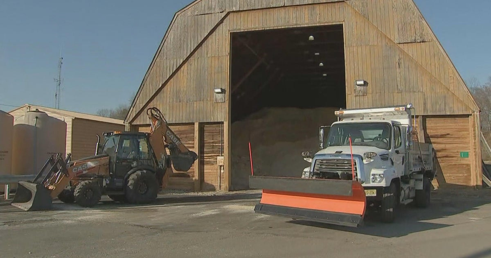

# South Jersey communities prepare for possible snow this weekend

*Image conveys a frame the text doesn't*

**Source:** www.cbsnews.com (left_lean) — 2024-01-03 21:15:24
**Original article:** https://www.cbsnews.com/philadelphia/news/new-jersey-communities-prepare-for-possible-snow-this-weekend/

## Article text

HADDONFIELD, N.J. (CBS) – The salt pile at Camden County's Public Works Complex sat untouched for two years with back-to-back mild winters. But come , that could change.
"Everything for us is about preparedness, and I think regardless of what's going to happen, we always prepare for what we think is going to happen," Camden County Commissioner Al Dyer said.
Bob Harris, the county's director of public works, said the dump truck and backhoe are brand new and ready to roll.
"We're ready, our crews are trained, our equipment is ready," Harris said.
READ MORE:
With no measurable snow since January 2022, the county has been able to reallocate some of its winter budget to buy new equipment and complete other infrastructure projects with money left over.
"We might have a drainage issue within the county somewhere or within the county roads, and we can reallocate the funds to that project," Harris said.
In Haddonfield, plows are being hooked on to trucks and crews are getting equipment ready. The public works department is closely monitoring the forecast to see if there is a better chance for snow, rain, or a mix in the area. That all plays a part in how to pre-treat the roads.
RELATED:
"Last year we were really hoping for snow," Odett Lenchus said. "We just didn't get any."
The Lenchus family is hoping to see all snow this weekend, but Lara Lenchus admits she will have to search for the winter gear because it hasn't been used in awhile.
"Last year was very mild so the girls were very disappointed," she said.

## Target labels (2-of-3 consensus across the labeling ensemble)

- **Text frame:** Capacity & Resources
- **Image frame:** Capacity & Resources, Policy Prescription & Evaluation
